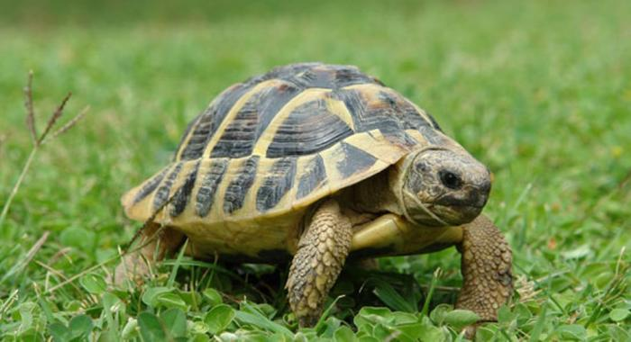

#presentation

This is Lucrezia's website! [@ggplot]!

And this is a squirrel 

@fig-tarta presents a turtle

## Sub presentation

sub section $X = V + E$

### Sub sub section 

another sub sub section

::: {.column-margin}

$$X = V+E$$  {#eq-ctt}

:::

#### Paragraph

this is the paragraph 

::: {.grid}

::: {.g-col-4}
This is my first column
:::

::: {.g-col-4}
This is my second column
:::

:::{.g-col-4}
This is my third column

For further details look at the [code chunks](code chunks.html) file. 
:::

::: 